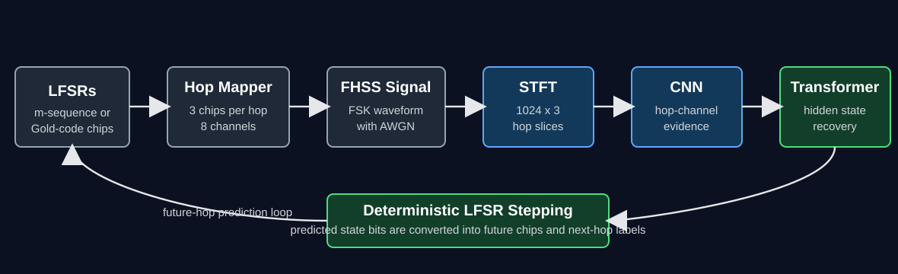
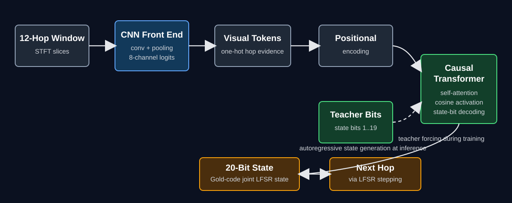
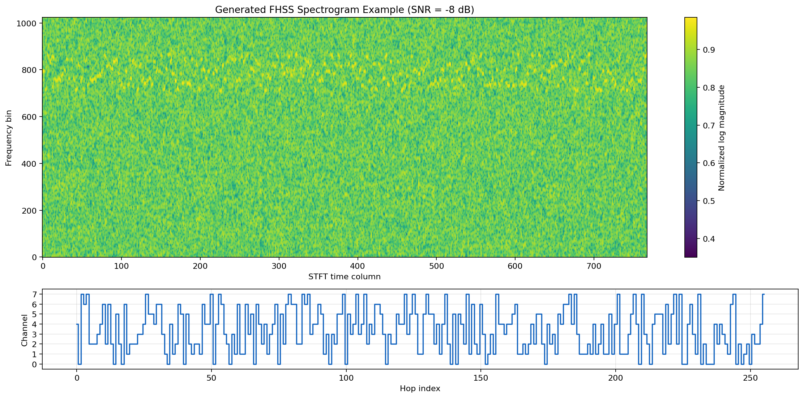
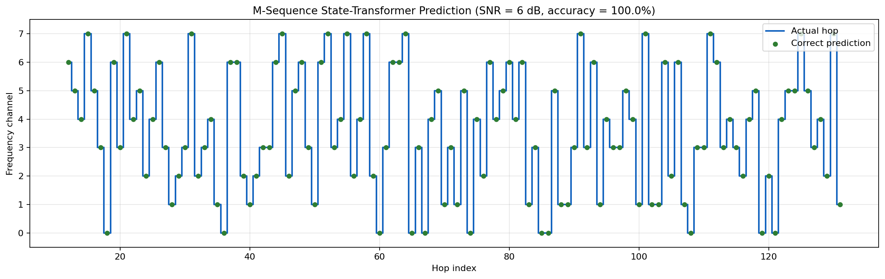
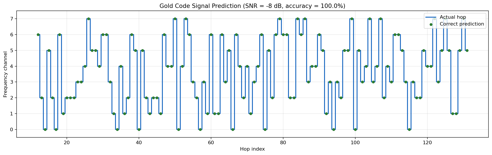
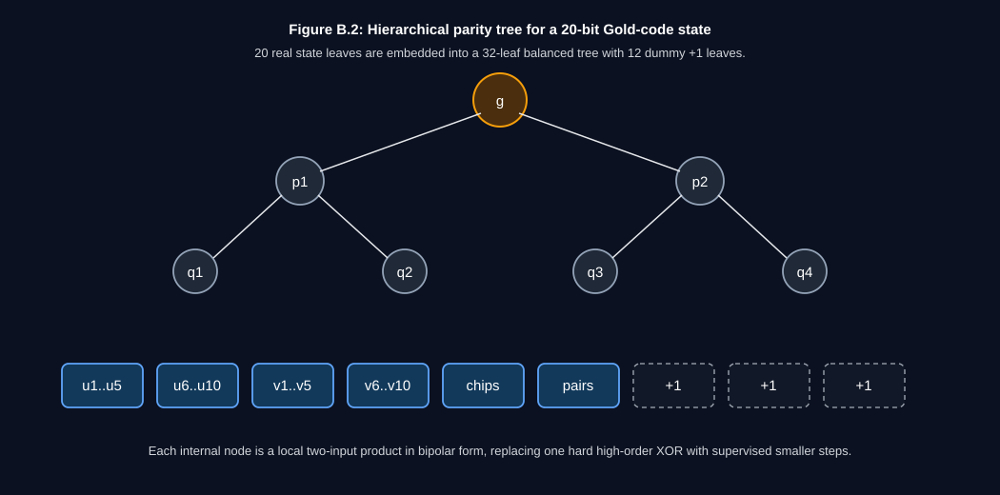
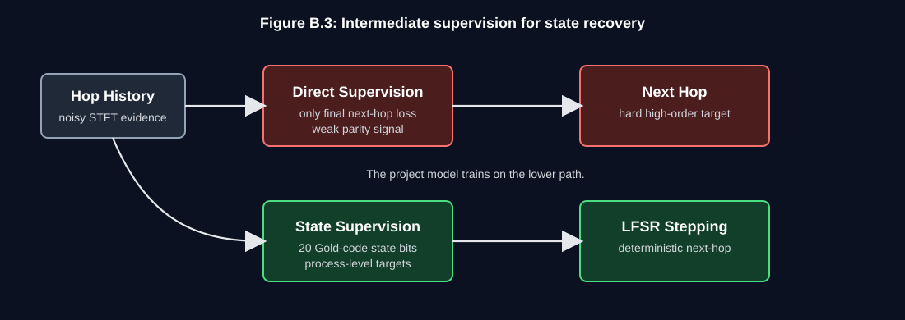
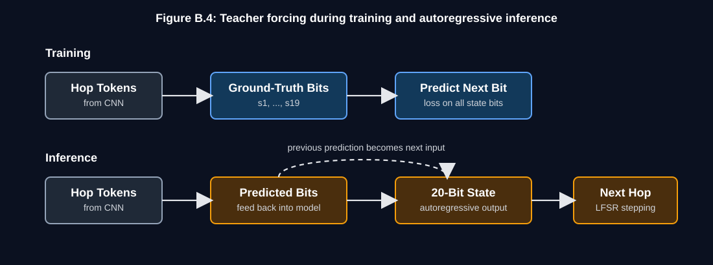

# FHSS State-Recovery Transformer

This repository contains a Python implementation of an FHSS sequence-recovery pipeline. The main experiment uses generated Frequency-Hopping Spread Spectrum signals whose hopping pattern is controlled by LFSR-based pseudo-noise sequences. A CNN extracts hop-level channel evidence from STFT spectrogram slices, and a state-tracking transformer predicts the hidden generator state used to produce future hops.

The project focuses on two sequence families:

- **Gold codes:** two degree-10 LFSRs whose outputs are XOR-combined. The model predicts the 20-bit joint state.
- **M-sequences:** one degree-10 LFSR, used as a simpler control task. The model predicts the 10-bit state.

## Repository Layout

```text
.
|-- src/
|   `-- python/
|       |-- berlekamp_massey.py      # Algebraic LFSR recovery utilities
|       |-- dsp_utils.py             # FSK, AWGN, and STFT helpers
|       `-- gold_code.py             # LFSR and Gold-code generation
|-- data/
|   `-- synthetic/                   # Generated datasets
|-- models/                          # Local checkpoints
|-- results/                         # Local plots and diagnostics
|-- generate_dataset.py              # Gold-code FHSS dataset generation
|-- generate_m_sequence_dataset.py   # M-sequence dataset generation utility
|-- prepare_sequences.py             # Gold-code sequence-window preparation
|-- prepare_sequences_m.py           # M-sequence sequence-window preparation
|-- train_cnn.py                     # CNN hop-classifier pretraining
|-- train_state_transformer.py       # Gold-code state-transformer training
|-- train_m_sequence_state_transformer.py
|-- generate_result_plots.py         # Result figure generation from local artifacts
|-- requirements.txt
`-- README.md
```

## Setup

Use Python 3.10 or newer. A CUDA-capable GPU is recommended for full training.

```powershell
python -m venv .venv
.\.venv\Scripts\Activate.ps1
python -m pip install --upgrade pip
python -m pip install -r requirements.txt
```

If you need GPU acceleration, install the PyTorch build that matches your CUDA version before installing or after adjusting `requirements.txt`.

## Gold-Code Workflow



Generate the Gold-code FHSS spectrogram dataset:

```powershell
python generate_dataset.py
```

Prepare sequence-window indices:

```powershell
python prepare_sequences.py
```

Pretrain the CNN hop classifier:

```powershell
python train_cnn.py
```

Train the Gold-code state transformer:

```powershell
python train_state_transformer.py
```

The Gold-code model predicts the 20-bit joint state of two degree-10 LFSRs. Training uses intermediate state-bit supervision with teacher forcing; validation runs autoregressively.

## Model Architecture



## M-Sequence Control Workflow

The m-sequence control script can generate a compact dataset and train the single-register state model:

```powershell
python train_m_sequence_state_transformer.py --generate-if-missing --signals 120 --epochs 40 --pretrain-cnn-epochs 1
```

Useful options:

```text
--target-hop-acc <percent>       stop when validation hop accuracy reaches target
--target-state-acc <percent>     stop when exact state accuracy reaches target
--plot-only                      regenerate the training plot from a saved checkpoint
--no-load-ram                    stream HDF5 samples instead of loading tensors into RAM
```

## Result Plots

After local datasets and checkpoints are available, regenerate the result figures with:

```powershell
python generate_result_plots.py
```

By default, the script writes:

```text
results/report_state_transformer_training.png
results/report_gold_spectrogram.png
results/report_gold_prediction.png
results/report_bm_vs_transformer.png
results/report_mseq_state_transformer_training.png
results/report_mseq_prediction.png
results/report_figure_summary.json
```

The script uses generic checkpoint paths under `models/`. Run `python generate_result_plots.py --help` to override dataset, checkpoint, history, signal-index, and output-directory paths.

## Result Figures

**Figure 5.2: Generated Gold-code FHSS spectrogram**



**Figure 5.4: M-sequence state-transformer prediction example**



**Figure 5.5: Gold-code state-transformer prediction example**



## Chain-of-Thought Decomposition

**Figure B.2: Hierarchical parity tree**



**Figure B.3: Intermediate supervision**



**Figure B.4: Teacher forcing and autoregressive inference**



## Notes

- Hop labels are produced by grouping three pseudo-noise chips into one of eight frequency channels.
- Gold-code train, validation, and test examples use disjoint seed pools.
- Berlekamp-Massey utilities are included for clean symbolic LFSR recovery comparisons.
